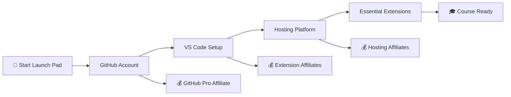
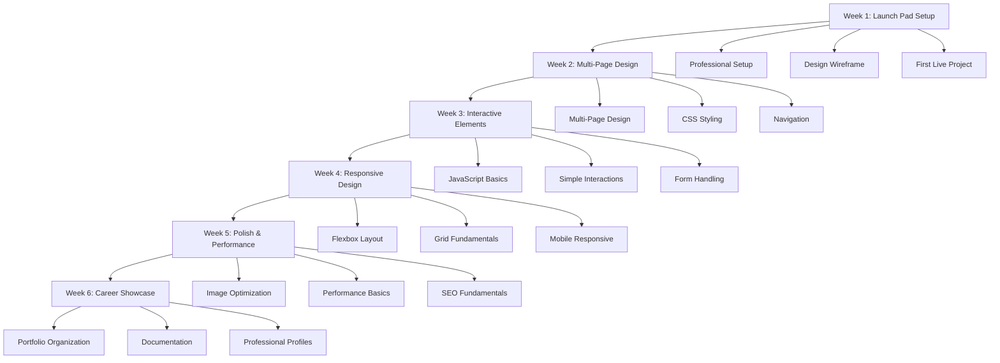

# 🚀 **RockitCode MASTER COURSE BLUEPRINT**
## "HTML & CSS Fundamentals" - Course Template for All Future Courses

---

## 🎯 **RockitCode Course Development Strategy**

### **Brand Architecture**
```
🚀 RockitCode (Main Platform)
   ├── 🎯 Launch Pad (Onboarding + Affiliate Revenue)
   │   ├── GitHub Account Setup (affiliate)
   │   ├── VS Code Installation (affiliate)
   │   ├── Hosting Platform Setup (affiliate)
   │   └── Essential Tool Configuration
   │
   ├── 📚 Course Categories
   │   ├── Beginner Courses (Simple, clear concepts)
   │   ├── Intermediate Courses (Multi-tech integration)
   │   ├── Advanced Courses (Complex problem solving)
   │   └── Specialized Tracks (Career-specific paths)
   │
   └── 💼 Portfolio Ecosystem (Living Projects)
       ├── Project-Based Learning
       ├── Cumulative Skill Building
       └── Career-Ready Outcomes
```

### **Course Design Principles**
1. **Multi-Language When Beneficial**: Courses can combine HTML/CSS/JS, Python/SQL, React/Node.js when it creates exceptional learning
2. **Strict Skill Level Adherence**: Beginner courses = beginner code complexity only
3. **Living Portfolio Approach**: Each lesson builds on previous work
4. **Affiliate Revenue Integration**: Launch Pad onboarding includes monetized tool setups
5. **Clear Progression Paths**: Each course prepares students for the next level

---

## 📋 **LAUNCH PAD ONBOARDING SEQUENCE**

### **🎯 Pre-Course Setup (Revenue-Generating Affiliate Funnel)**

**Launch Pad Mission**: Get students set up with professional tools while generating affiliate revenue



### **Affiliate Revenue Opportunities**
- **GitHub**: GitHub Pro subscriptions, GitHub Copilot
- **VS Code**: Premium extensions, themes, productivity tools
- **Hosting**: Netlify Pro, Vercel Pro, AWS credits
- **Design Tools**: Figma Pro, Adobe Creative Suite
- **Learning Resources**: Premium course platforms, books

---

## 📚 **MASTER COURSE TEMPLATE: "HTML & CSS Fundamentals"**

### **Course Positioning**
- **Target Level**: Beginner
- **Duration**: 6 weeks
- **Technologies**: HTML5, CSS3, Basic JavaScript (for interactions only)
- **Outcome**: Professional multi-page portfolio website
- **Code Complexity**: Beginner-appropriate throughout

### **🎯 Learning Journey Progression**



### **📚 Course Structure at a Glance (ONE EVOLVING PORTFOLIO)**

| Week | Mission Focus | Portfolio Evolution | Skills Added | Cumulative Outcome |
|------|---------------|-------------------|--------------|-------------------|
| **1** | Launch Pad Setup | Launch Personal Portfolio | Professional tools, HTML basics, CSS basics | Live personal website |
| **2** | Multi-Page Design | Add Multiple Pages | CSS styling, Navigation, File organization | Multi-page portfolio |
| **3** | Interactive Elements | Add Interactivity | JavaScript basics, DOM manipulation | Interactive portfolio |
| **4** | Responsive Design | Make Mobile-Perfect | CSS Grid/Flexbox, Media queries | Responsive portfolio |
| **5** | Polish & Performance | Optimize & Perfect | Image optimization, Performance, SEO | Professional portfolio |
| **6** | Career Showcase | Document & Present | Case studies, Documentation, Professional profiles | Career-ready showcase |

### **🎮 Interactive Learning Flow (Per Chapter)**

```
📺 Hero Video (5 min)
    ↓
🎯 Learning Objectives
    ↓
📚 Interactive Modules (4-6 modules)
    ├── Hands-on Labs
    ├── Code Playgrounds  
    ├── Knowledge Checks
    └── Mini-Challenges
    ↓
🔨 Project Integration
    ↓
👥 Peer Review
    ↓
🏆 Achievement Unlock
    ↓
📈 Progress Update
```

### **💪 Skill Development Timeline (COMPLETE BEGINNER FOCUS - NO EXPERIENCE REQUIRED)**

#### **Week 1: What is Web Development? (Start from Zero)**
- **Day 1**: What is a website? How does the internet work? (Complete beginner introduction)
- **Day 2**: Professional setup (GitHub, VS Code) - Step-by-step for first-time users
- **Day 3-4**: Design wireframing in Figma (No design experience needed - templates provided)
- **Day 5-7**: HTML fundamentals and first webpage (What are HTML tags?)
- **Skills**: Internet basics, Design thinking, HTML5 basics, Professional setup

#### **Week 2: Making Websites Look Good**
- **Day 1-3**: CSS basics - What is styling? Colors, fonts, spacing (Step-by-step)
- **Day 4-5**: CSS layout basics (margins, padding, positioning) - Visual demonstrations
- **Day 6-7**: Navigation and linking pages (How websites connect together)
- **Skills**: CSS fundamentals, Basic layout, Website structure, File organization

#### **Week 3: Making Websites Interactive**
- **Day 1-3**: JavaScript basics - What makes websites "do things"? (Variables, functions explained simply)
- **Day 4-5**: Simple DOM manipulation (Making buttons work, showing/hiding content)
- **Day 6-7**: Basic form handling (Contact forms, simple validation)
- **Skills**: JavaScript fundamentals, Basic interactions, Form basics

#### **Week 4: Making Websites Work on Phones**
- **Day 1-2**: CSS Flexbox basics (Arranging items in rows and columns)
- **Day 3-4**: CSS Grid fundamentals (Creating layouts like a pro)
- **Day 5-7**: Media queries and mobile-first design (Why mobile matters)
- **Skills**: Responsive design, Mobile optimization, Modern layouts

#### **Week 5: Making Websites Fast and Found**
- **Day 1-3**: Image optimization and performance basics (Why speed matters)
- **Day 4-5**: SEO fundamentals (How people find your website)
- **Day 6-7**: Accessibility basics (Making websites for everyone)
- **Skills**: Performance basics, SEO fundamentals, Accessibility awareness

#### **Week 6: Showing Off Your Work**
- **Day 1-2**: Organizing portfolio projects (Telling your story)
- **Day 3-4**: Writing project documentation (Explaining what you built)
- **Day 5-7**: Creating professional profiles (LinkedIn, resume basics)
- **Skills**: Portfolio presentation, Documentation, Professional presence

### **🎯 Learning Outcomes by Week (COMPLETE BEGINNER TRANSFORMATION)**

```mermaid
gantt
    title Complete Beginner to Professional Portfolio (6 Weeks)
    dateFormat X
    axisFormat %d

    section Week 1 (Zero Experience)
    What is Web Development?    :milestone, m1, 1, 1d
    Wireframing in Figma        :active, wireframe, 2, 3d
    HTML Basics                 :html, 4, 4d
    
    section Week 2 (Visual Design)
    CSS Fundamentals           :css, 8, 4d
    Basic Layout & Navigation  :layout, 11, 4d
    
    section Week 3 (Interactivity)
    JavaScript Basics          :js, 15, 4d
    Button Clicks & Forms      :interact, 18, 3d
    
    section Week 4 (Mobile Ready)
    Flexbox & Grid            :responsive, 22, 4d
    Mobile-First Design       :mobile, 25, 3d
    
    section Week 5 (Professional)
    Fast Loading Sites        :perf, 29, 3d
    SEO & Accessibility       :seo, 32, 4d
    
    section Week 6 (Portfolio Launch)
    Portfolio Organization    :portfolio, 36, 3d
    Professional Profiles     :professional, 39, 4d
    Career Launch Prep        :milestone, m2, 42, 1d
```



**Transformation Journey:**
- **Start**: Never coded before (13+ years old)
- **Week 1**: Understands what websites are, can create wireframes, built first webpage
- **Week 2**: Creates styled multi-page websites that look professional
- **Week 3**: Adds interactive elements (buttons work, forms submit)
- **Week 4**: Websites work perfectly on phones and tablets
- **Week 5**: Websites load fast and can be found on Google
- **Week 6**: Has professional portfolio and LinkedIn profile ready for opportunities

### **🎯 Portfolio Evolution Journey (ONE CONTINUOUSLY IMPROVING PROJECT)**

```
Week 1: Personal Portfolio Foundation (myname.github.io)
    ↓ Add new pages and navigation
Week 2: Multi-Page Portfolio (About, Projects, Contact)
    ↓ Add interactive elements
Week 3: Interactive Portfolio (Working buttons, forms, animations)
    ↓ Make mobile-responsive
Week 4: Fully Responsive Portfolio (Perfect on all devices)
    ↓ Optimize and polish
Week 5: Professional Optimized Portfolio (Fast, SEO-ready)
    ↓ Document and present
Week 6: Career-Ready Portfolio Showcase (Case studies, documentation)
```

**🔄 Continuous Evolution Philosophy:**
- **Never start over** - Always build on previous work
- **Incremental improvement** - Each week makes the same portfolio better
- **Compound learning** - Skills stack and reinforce each other
- **Real progress** - Students see their work grow more professional
- **No wasted effort** - Every hour contributes to the final showcase

### **📊 Learning Metrics & Tracking**

#### **Daily Engagement Metrics:**
- **Completion Rate**: Track progress through each module
- **Code Quality Score**: Automated assessment of student code
- **Peer Review Points**: Community contribution tracking
- **Streak Counter**: Consecutive days of active learning
- **Achievement Badges**: Skill milestones and special accomplishments

#### **Weekly Portfolio Milestones:**
- **Week 1**: ✅ Live website deployment
- **Week 2**: ✅ Responsive design mastery
- **Week 3**: ✅ Interactive application
- **Week 4**: ✅ Framework-based project
- **Week 5**: ✅ Full-stack application
- **Week 6**: ✅ Professional portfolio

#### **Skill Progression Tracking (BEGINNER LEVEL):**
```typescript
interface BeginnerSkillProgression {
  technical: {
    htmlBasics: 0 → 85% (Week 1-2)
    cssBasics: 0 → 80% (Week 1-4)
    javascriptBasics: 0 → 60% (Week 3)
    responsiveDesign: 0 → 70% (Week 4)
    basicOptimization: 0 → 50% (Week 5)
  }
  professional: {
    gitBasics: 0 → 75% (Week 1)
    fileOrganization: 0 → 85% (Week 2)
    basicTesting: 0 → 60% (Week 5)
    documentation: 0 → 70% (Week 6)
    portfolioPresentation: 0 → 80% (Week 6)
  }
}
```

### **🚀 Student Success Journey (BEGINNER LEVEL)**

#### **Week 1 Outcomes:**
- ✅ Professional GitHub profile setup
- ✅ First live website at username.github.io
- ✅ Basic HTML structure understanding
- ✅ Simple CSS styling skills

#### **Week 2 Outcomes:**
- ✅ Multi-page website creation
- ✅ Basic CSS layout skills
- ✅ Navigation between pages
- ✅ File organization best practices

#### **Week 3 Outcomes:**
- ✅ Basic JavaScript interactions
- ✅ Simple DOM manipulation
- ✅ Form handling basics
- ✅ Event listener fundamentals

#### **Week 4 Outcomes:**
- ✅ Responsive design with Flexbox
- ✅ CSS Grid fundamentals
- ✅ Mobile-first approach
- ✅ Cross-device compatibility

#### **Week 5 Outcomes:**
- ✅ Image optimization basics
- ✅ Performance fundamentals
- ✅ SEO basics implementation
- ✅ Accessibility awareness

#### **Week 6 Outcomes:**
- ✅ Organized portfolio presentation
- ✅ Project documentation skills
- ✅ Basic resume preparation
- ✅ Professional online presence

### **💼 Career Readiness Framework (BEGINNER LEVEL)**

#### **Portfolio Evolution Showcase (ONE CONTINUALLY IMPROVING PROJECT):**

**🚀 Your Personal Portfolio Journey (myname.github.io)**

**Week 1 Foundation: "My First Real Website!"**
- **Starting Point**: Simple personal introduction webpage with name, photo, and bio
- **Why it matters**: First live website on the internet - parents can share the link!
- **Week 1 Features**: Basic HTML structure, simple CSS styling, deployed on GitHub Pages
- **Milestone Achievement**: "I built a real website that's live on the internet!"

**Week 2 Expansion: "Like Real Professional Websites!"**
- **Building On**: Add About, Projects, and Contact pages to existing site
- **Why it matters**: Now looks like professional websites they see every day
- **Week 2 Additions**: Navigation menu, consistent design, multiple pages, contact form
- **Milestone Achievement**: "My website has multiple pages and navigation!"

**Week 3 Interactive: "My Website Actually Does Things!"**
- **Building On**: Add interactive elements to existing portfolio pages
- **Why it matters**: Website feels "alive" and modern like top websites
- **Week 3 Additions**: Working buttons, image galleries, form validation, smooth scrolling
- **Milestone Achievement**: "Buttons work, forms submit, animations happen!"

**Week 4 Mobile-Perfect: "Looks Amazing on Every Device!"**
- **Building On**: Make existing portfolio responsive for all screen sizes
- **Why it matters**: Most people browse on phones - essential for professional sites
- **Week 4 Additions**: CSS Grid/Flexbox layouts, mobile navigation, touch-friendly design
- **Milestone Achievement**: "My website looks perfect on phones, tablets, and computers!"

**Week 5 Professional: "Fast, Found, and Flawless!"**
- **Building On**: Optimize existing portfolio for speed and search engines
- **Why it matters**: Fast sites rank higher and get more visitors
- **Week 5 Additions**: Image optimization, SEO meta tags, performance improvements, accessibility
- **Milestone Achievement**: "My website loads instantly and can be found on Google!"

**Week 6 Career-Ready: "Portfolio That Opens Doors!"**
- **Building On**: Document projects and present work professionally
- **Why it matters**: Shows growth journey and readiness for opportunities
- **Week 6 Additions**: Project case studies, technical documentation, professional presentation
- **Milestone Achievement**: "My portfolio tells my story and opens career opportunities!"

**🎯 Final Result: ONE Amazing Portfolio**
- **Single URL**: myname.github.io (easy to remember and share)
- **Professional Quality**: Matches standards of top professional portfolios
- **Complete Story**: Shows 6 weeks of growth and learning
- **Career Ready**: Demonstrates competency to recruiters and employers
- **Personal Pride**: "I built this entire professional website myself!"
- **Professional outcome**: Professional mobile experience like top websites

**Project 5: Lightning-Fast Portfolio (Loads Super Quick!)**
- **What it is**: Optimized portfolio that loads instantly and can be found on Google
- **Why it matters**: Fast sites get more visitors and rank higher in search results
- **Beginner-friendly**: Step-by-step optimization guides, beginner SEO checklist
- **Professional outcome**: Performance scores comparable to professional websites

#### **Skills Developed (COMPLETE BEGINNER TO COMPETENT):**

**🎨 Design & Planning Skills (No Design Experience Required):**
- **Wireframing Basics**: Using Figma templates to plan website layouts
- **Color & Typography**: Choosing colors and fonts that look professional
- **User Experience Thinking**: Making websites easy and fun to use
- **Professional Design Standards**: Creating websites that look like TailwindUI examples

**💻 Technical Skills (Zero Coding Experience to Competent):**
- **HTML Fundamentals**: Writing clean, semantic markup (what are HTML tags?)
- **CSS Styling**: Making websites look beautiful with colors, fonts, layouts
- **JavaScript Basics**: Adding interactivity - buttons, forms, simple animations
- **Responsive Design**: Making websites work perfectly on all devices
- **Performance Basics**: Making websites load quickly and rank on Google

**🔧 Professional Development Skills (Ready for Real World):**
- **GitHub Workflow**: Professional version control and project deployment
- **Documentation**: Explaining projects clearly for others to understand
- **Problem-Solving**: Debugging code and finding solutions independently
- **Portfolio Presentation**: Showcasing work professionally for opportunities
- **Learning Skills**: Continuing to grow and learn new technologies independently

#### **Complete Beginner Transformation (13+ Years to Job-Ready Foundation):**

**🚀 From Zero Experience To:**
- **Technical Confidence**: Can build and deploy professional-looking websites independently
- **Design Competency**: Creates wireframes and implements designs that match professional standards
- **Problem-Solving Skills**: Debugs code issues and implements solutions with minimal guidance
- **Professional Readiness**: Has portfolio, GitHub profile, and documentation skills for opportunities
- **Learning Foundation**: Ready to tackle intermediate challenges and continue growing independently

**🎯 Career Preparation Foundation:**
- **Portfolio Quality**: ONE professional showcase that demonstrates complete skill progression
- **GitHub Presence**: Professional profile with consistent contribution history showing growth
- **Technical Communication**: Can explain projects and code to technical and non-technical audiences
- **Growth Mindset**: Equipped with learning strategies for continuous skill development
- **Complete Story**: Portfolio tells the journey from beginner to competent developer

---

## 🌟 **WHAT MAKES THIS THE WORLD'S BEST LEARNING PLATFORM**dation Launch - Portfolio Development Mastery"

### **🎯 Course Overview & Strategic Positioning**

**Course Philosophy**: Every lesson evolves ONE live portfolio project using professional GitHub workflows, transforming beginners into job-ready developers with an impressive evolving showcase.

**Mission Framework**: "Pre-Flight Check" → "Foundation Launch" progression  
**Duration**: 6 weeks (4-6 hours/week)  
**Outcome**: ONE professional portfolio that evolves from basic to career-ready + GitHub profile  
**Cost Model**: 100% free lessons forever on RockitCode  

**🎯 One Portfolio Evolution Strategy:**
- **Week 1**: Launch personal portfolio foundation
- **Week 2**: Expand into multi-page professional site  
- **Week 3**: Add interactive features and functionality
- **Week 4**: Perfect responsive design for all devices
- **Week 5**: Optimize for performance and search engines
- **Week 6**: Document and present for career opportunities  

---

## 📋 **COURSE ARCHITECTURE BLUEPRINT**

### **Core Learning Infrastructure:**
```typescript
interface CourseBlueprint {
  platform: "GitHub-First Professional Development"
  costModel: "100% free lessons forever on RockitCode"
  portfolioIntegration: "Every lesson = Live portfolio project"
  professionalTools: "GitHub Copilot + Student Pack + VS Code"
  deploymentStrategy: "GitHub Pages + Vercel automatic deployment"
  assessmentMethod: "Live projects + peer code review"
}
```

### **Interactive Learning Components (MICRO-LEARNING TO MASTERY METHOD):**

#### **🧠 Concept-First Teaching Engine:**
1. **Micro-Concept Mastery** - Learn ONE concept at a time with immediate practice
2. **Building Block Progression** - Each concept builds on the previous one toward target code
3. **Interactive Code Labs** - Hands-on practice environments for each concept
4. **Real-Time Feedback** - Instant validation and gentle correction as they learn
5. **Progressive Challenges** - Concepts combine into increasingly complex solutions

#### **🔧 Hands-On Learning Mechanics:**
6. **Concept Playground** - Interactive environments to experiment with each coding concept
7. **Practice-to-Perfection** - Multiple exercises until concept mastery is achieved
8. **Guided Application** - Apply learned concepts to solve specific problems
9. **Pattern Recognition** - Identify how concepts combine to create solutions
10. **Independent Building** - Students write code using learned concepts (no templates!)

#### **� Teaching Progression Strategy:**
11. **Atomic Learning** - Break complex code into fundamental concepts
12. **Scaffolded Practice** - Start with simplest version, build complexity gradually
13. **Conceptual Understanding** - WHY before HOW - understand purpose before syntax
14. **Active Construction** - Students build code themselves using learned principles
15. **Mastery Validation** - Prove understanding by explaining AND building

#### **📚 Lesson Structure (Concept → Application):**
```
🎬 Hero Video (5 min) - Shows WHAT they'll build and WHY it matters
    ↓
🧠 Concept Introduction - Learn ONE fundamental concept
    ↓
🔬 Interactive Lab - Experiment with concept in playground
    ↓
💡 Guided Practice - Apply concept to solve simple problems
    ↓
🔨 Building Challenge - Use concept to create part of target solution
    ↓
🧩 Concept Combination - Connect with previously learned concepts
    ↓
✅ Mastery Check - Build target code independently using learned concepts
    ↓
🔨 Portfolio Integration - Add completed code to live project
```

#### **💻 Pre-Written Target Strategy:**
- **End Goal Defined** - We know exactly what professional code they need to write
- **Concept Decomposition** - Break target into teachable micro-concepts
- **Learning Path Design** - Optimal sequence from zero to target code competency
- **Practice Variations** - Multiple ways to practice each concept for different learning styles
- **Assessment Clarity** - Clear success criteria for each concept and combined application

#### **🔍 Example: Guided Code Discovery in Action**

**Target Code We Want Students to Write (HTML Navigation):**
```html
<nav class="navbar">
  <div class="nav-container">
    <h1 class="nav-logo">MyPortfolio</h1>
    <ul class="nav-menu">
      <li class="nav-item">
        <a href="#about" class="nav-link">About</a>
      </li>
      <li class="nav-item">
        <a href="#projects" class="nav-link">Projects</a>
      </li>
      <li class="nav-item">
        <a href="#contact" class="nav-link">Contact</a>
      </li>
    </ul>
  </div>
</nav>
```

**🎮 Discovery Process:**

**Step 1: Concept Introduction - "What are HTML Tags?"**
- Interactive Lab: "Try typing `<h1>Hello</h1>` in the editor"
- Watch it render: "Hello" appears as a large heading
- Practice: Create headings h1, h2, h3 with different text
- Understanding: Tags wrap content and give it meaning

**Step 2: Concept Introduction - "What are Lists?"**
- Interactive Lab: "Try typing `<ul><li>Item 1</li><li>Item 2</li></ul>`"
- Watch it render: Bulleted list appears
- Practice: Create lists with different items
- Understanding: Lists organize related information

**Step 3: Concept Introduction - "What are Links?"**
- Interactive Lab: "Try typing `<a href="#section">Click me</a>`"
- Watch it render: Clickable link appears
- Practice: Create links to different sections
- Understanding: Links connect to other parts of the page

**Step 4: Concept Introduction - "What are CSS Classes?"**
- Interactive Lab: "Add `class="big-text"` to your heading"
- CSS automatically styles it differently
- Practice: Add classes to different elements
- Understanding: Classes let us style elements

**Step 5: Building Challenge - "Create a Simple Menu"**
- Goal: "Make a list of 3 links for a website menu"
- Students apply learned concepts:
  - Use `<ul>` for the list structure
  - Use `<li>` for each menu item
  - Use `<a>` for clickable links
  - Add classes for styling
- No templates - they write the code using what they learned

**Step 6: Advanced Concept - "Semantic HTML"**
- Interactive Lab: "Replace `<div>` with `<nav>` for navigation"
- Understanding: `<nav>` tells browsers "this is navigation"
- Practice: Use semantic tags like `<header>`, `<main>`, `<footer>`

**Step 7: Master Challenge - "Build Professional Navigation"**
- Goal: "Create navigation that looks like professional websites"
- Students combine ALL learned concepts:
  - Semantic `<nav>` wrapper
  - Container `<div>` for layout
  - `<h1>` for site logo
  - `<ul>` list for menu items
  - `<a>` links with proper attributes
  - CSS classes for professional styling

**✅ Success Criteria:**
- Student writes the exact target code using learned concepts
- Student explains WHY each tag is used
- Student can modify the navigation for different scenarios
- Student understands the pattern for building similar components

---

#### **📋 Complete Teaching Methodology (Zero to Target Code)**

**🎯 Our Philosophy: Concept → Practice → Build → Master**

**Phase 1: Individual Concept Mastery**
```
Concept: HTML Tags
├── Interactive Demo: See `<h1>` create a heading
├── Hands-on Lab: Type different heading tags
├── Mini Challenge: Create a page title
└── Understanding Check: Explain what tags do

Concept: Lists  
├── Interactive Demo: See `<ul><li>` create bullets
├── Hands-on Lab: Make different types of lists
├── Mini Challenge: Create a shopping list
└── Understanding Check: When would you use lists?

Concept: Links
├── Interactive Demo: See `<a href="">` create clickable text
├── Hands-on Lab: Create links to different pages
├── Mini Challenge: Build a simple link menu
└── Understanding Check: How do links work?
```

**Phase 2: Concept Combination Practice**
```
Challenge: "Build a Simple Website Menu"
Students use learned concepts:
├── Choose appropriate HTML tags (lists + links)
├── Structure content logically
├── Add CSS classes for styling
└── Test their creation works

No templates provided - they build using learned principles
```

**Phase 3: Professional Application**
```
Master Challenge: "Professional Navigation Component"
Students combine ALL concepts to create target code:
├── Semantic structure (`<nav>`, `<div>`)
├── Content hierarchy (`<h1>`, `<ul>`, `<li>`)
├── Interactive elements (`<a href="">`)
├── Professional styling (CSS classes)
└── Accessibility considerations

Result: Exact target code written independently
```

**🔄 Continuous Reinforcement Loop:**
1. **Learn concept** → 2. **Practice concept** → 3. **Apply concept** → 4. **Combine concepts** → 5. **Build target solution**

---

#### **🎯 World's Best Interactive Learning Engine:**

**Real-Time Code Playground Features:**
- **Live Preview**: See changes instantly as you type
- **Error Detection**: Gentle corrections with explanations  
- **Smart Hints**: Context-aware suggestions when stuck
- **Progress Tracking**: Visual mastery of each concept
- **Celebration Moments**: Achievements unlock as concepts are mastered

**Adaptive Learning System:**
- **Personalized Pace**: Students progress when ready, not on schedule
- **Multiple Learning Styles**: Visual, kinesthetic, auditory explanations
- **Mistake-Friendly**: Errors become learning opportunities
- **Confidence Building**: Success builds on previous success
- **Mastery-Based**: Move forward only when concepts are solid

This ensures students **truly understand coding fundamentals** and can **independently write professional code** rather than just copying templates!

---

## 🌟 **WHAT MAKES THIS THE WORLD'S BEST LEARNING PLATFORM**

### **🧠 Cognitive Science-Based Learning:**
- **Spaced Repetition**: Concepts revisited at optimal intervals for long-term retention
- **Active Recall**: Students build code from memory, not copy-paste
- **Interleaving**: Mix different concepts within lessons for deeper understanding
- **Immediate Feedback**: Instant validation and correction during coding
- **Chunking**: Complex topics broken into digestible micro-lessons

### **🎮 Gamification & Motivation:**
- **Progress Bars**: Visual progress on skills, projects, and career milestones
- **Achievement Badges**: Unlock rewards for coding streaks, clean code, helping peers
- **Leaderboards**: Friendly competition with anonymized peer rankings
- **Challenge Modes**: Timed coding challenges and debugging puzzles
- **Portfolio Evolution**: Watch your projects grow more sophisticated over time

### **🤖 AI-Powered Personalization:**
- **Adaptive Learning Path**: AI adjusts difficulty based on student performance
- **Smart Hints**: Context-aware suggestions when students get stuck
- **Code Review AI**: Automated feedback on code quality and best practices
- **Learning Analytics**: Track learning patterns and optimize study time
- **Personalized Projects**: AI suggests project variations based on interests

### **👥 Social Learning & Community:**
- **Pair Programming**: Virtual coding sessions with study partners
- **Code Review Exchange**: Students review each other's work for learning
- **Help Request System**: Get assistance from peers and mentors
- **Show & Tell**: Share completed projects for feedback and inspiration
- **Study Groups**: Join cohorts based on pace and learning goals

### **💪 Hands-On Learning Components:**

#### **Interactive Code Playgrounds:**
- **Live Error Detection**: Real-time syntax and logic error highlighting
- **Auto-Completion**: Smart code suggestions with explanations
- **Version History**: See how code evolves during problem-solving
- **Performance Metrics**: Track code execution speed and memory usage
- **Accessibility Testing**: Built-in tools to ensure inclusive design

#### **Project-Based Challenges:**
- **Debugging Scenarios**: Fix broken code with guided problem-solving
- **Feature Building**: Add functionality to existing codebases
- **Optimization Challenges**: Improve performance of working code
- **Design Implementation**: Convert mockups to responsive code
- **API Integration**: Connect to real-world services and data

#### **Knowledge Reinforcement:**
- **Concept Quizzes**: Multiple choice with immediate explanations
- **Code Completion**: Fill-in-the-blank coding exercises
- **Bug Hunt**: Find and fix errors in provided code
- **Code Explanation**: Describe what code snippets do
- **Best Practice Selection**: Choose optimal solutions from alternatives

### **📱 Mobile-Optimized Learning:**
- **Touch-Friendly Code Editor**: Optimized for tablet and phone coding
- **Voice Coding**: Dictate code using speech recognition
- **Gesture Navigation**: Swipe between lessons and concepts
- **Offline Mode**: Download lessons for learning without internet
- **Push Notifications**: Smart reminders based on learning patterns

### **🎯 Real-World Application:**
- **Industry Projects**: Work on replicas of real company challenges
- **Professional Workflows**: Use actual tools developers use daily
- **Code Reviews**: Experience real peer review processes
- **Deployment Pipeline**: Deploy to production-like environments
- **Client Communication**: Practice explaining technical concepts

---

## �🎯 **WEEK-BY-WEEK COURSE ROADMAP**

### **Week 1: Pre-Flight Check - Professional Developer Setup**
**Mission Objective**: Transform from beginner to professional developer environment in 1 week

#### **Chapter 1.1: Mission Control Setup (Day 1-2)**
**Learning Objectives**: Set up professional GitHub account, activate Student Pack, configure VS Code with Copilot, make first commit

**🎬 Hero Video**: "Welcome to Your Developer Mission - From Zero to Live Code in 2 Days" (5 min overview)

**📚 Interactive Learning Modules:**

1. **GitHub Account Setup Wizard**
   - Interactive form with real-time validation
   - Profile optimization checklist with live preview
   - Username availability checker
   - Professional photo upload guide
   - **Immediate Result**: Professional GitHub profile created

2. **Student Pack Activation Game**
   - Step-by-step interactive tutorial
   - Progress bar showing $200k+ tools unlocked
   - Achievement badges for each tool activated
   - Celebration animations for milestones
   - **Immediate Result**: $200k+ in free developer tools activated

3. **VS Code + Git Professional Setup Lab**
   - **Download & Install VS Code**: Step-by-step installation guide
   - **Git Installation**: Automatic detection or guided installation
   - **VS Code Configuration**: Essential extensions and settings
   - **GitHub Authentication**: Connect VS Code to GitHub account
   - **Copilot Activation**: AI coding assistant setup and test
   - **Immediate Result**: Professional coding environment ready

4. **First Repository Creation Challenge**
   - **Create Repository**: Interactive GitHub repo creation
   - **Clone to VS Code**: One-click repository cloning
   - **First File Creation**: Create simple `index.html` in VS Code
   - **Git Workflow**: Add, commit, push - see changes live on GitHub
   - **Immediate Result**: First code published to GitHub!

5. **Live Deployment Magic**
   - **GitHub Pages Activation**: Turn repository into live website
   - **First Live Site**: Watch `index.html` become `username.github.io`
   - **Share Your Success**: Get shareable link for friends/family
   - **Immediate Result**: "I published my first website!"

**🎯 Learning Validation:**
- Students see their code in VS Code
- Students see same code on GitHub
- Students see live website at username.github.io
- Students understand: Code → GitHub → Live Website

**✅ Skills Unlocked**: 
- Professional development environment (VS Code + Git)
- GitHub workflow (clone, edit, commit, push)
- Live deployment (GitHub Pages)
- AI-assisted coding (Copilot basics)

#### **Chapter 1.2: First Professional Portfolio (Day 3-4)**
**Project**: Build personal landing page using VS Code → GitHub → Live deployment workflow
**🎬 Hero Video**: "Building Your Professional Portfolio - The Developer Way" (5 min overview)

**📚 Interactive Learning Experience (Using Professional Tools):**

1. **VS Code HTML Development**
   - **Open existing repository in VS Code**
   - **Learn HTML basics through hands-on coding**
   - **Live preview in VS Code** (Live Server extension)
   - **AI assistance with Copilot** for HTML suggestions
   - **Real-time validation** and syntax highlighting

2. **Professional CSS Styling**
   - **CSS file creation in VS Code**
   - **Professional color schemes and typography**
   - **Copilot-assisted styling** for modern design
   - **Live preview updates** as you code
   - **File organization** best practices

3. **Git Workflow Integration**
   - **Stage changes** in VS Code Git panel
   - **Write meaningful commit messages**
   - **Push to GitHub** with one click
   - **See changes instantly** on GitHub
   - **Watch live site update** at username.github.io

4. **Professional Portfolio Content**
   - **Personal branding** with clean design
   - **Professional photo and bio**
   - **Contact information and links**
   - **SEO optimization** basics
   - **Mobile-friendly responsive design**

**🎯 Learning Validation:**
- Code professionally in VS Code
- Use Git like a real developer
- See work published instantly
- Share live portfolio URL

**🎯 Portfolio Outcome**: Live professional portfolio at username.github.io
**✅ Skills Unlocked**: HTML5 semantics, CSS fundamentals, Professional Git workflow, Live deployment
   - Drag-and-drop HTML element playground
   - Live semantic HTML validator
   - Accessibility checker with real-time feedback
   - Code completion with AI suggestions

2. **CSS Design Lab**
   - Interactive color picker with accessibility contrast checker
   - Typography playground with Google Fonts integration
   - Layout builder with CSS Grid/Flexbox visualizer
   - Responsive design tester with device simulation

3. **GitHub Deploy Challenge**
   - Step-by-step repository creation wizard
   - Interactive Git commands with visual feedback
   - GitHub Pages activation with instant preview
   - Domain connection tutorial with live testing

4. **Portfolio Integration Workshop**
   - Template selection with customization options
   - Personal branding questionnaire with AI suggestions
   - Content optimization with SEO checker
   - Professional presentation review

**🎯 Portfolio Outcome**: Live personal website at username.github.io
**✅ Skills Unlocked**: HTML5 semantics, CSS fundamentals, Git workflow, GitHub Pages

#### **Chapter 1.3: Professional Profile Optimization (Day 5-7)**
- **Enhancement Focus**: README profile, repository documentation, contribution graph

- **Video Content**:
  - [ ] GitHub Profile README: "Making Your Profile Stand Out" (10 min)
  - [ ] Repository Best Practices: Professional documentation (8 min)
  - [ ] Portfolio Presentation: Showcasing your work (6 min)

- **Interactive Features**:
  - README generator with templates
  - Repository documentation wizard
  - Portfolio showcase builder

- **Assessment**: Peer review of GitHub profiles
- **Portfolio Outcome**: Recruiter-ready GitHub profile with first live project

---

### **Week 2: Foundation Launch - Responsive Web Development**
**Mission Objective**: Master responsive design with professional deployment workflow

#### **Chapter 2.1: Responsive Navigation System (Day 1-3)**
- **Project**: Professional navigation component with mobile responsiveness
- **Technologies**: Advanced CSS, Flexbox, CSS Grid, JavaScript DOM

- **Video Content**:
  - [ ] Hero Video: "Building Professional Navigation" (6 min)
  - [ ] CSS Architecture: "Scalable styling systems" (12 min)
  - [ ] Responsive Design: "Mobile-first approach" (15 min)
  - [ ] JavaScript Interactivity: "Modern DOM manipulation" (10 min)

- **Interactive Components**:
  - Live CSS Grid/Flexbox playground
  - Responsive breakpoint tester
  - Navigation component builder
  - Mobile device simulator

- **GitHub Workflow**: Feature branch, pull request, code review, merge
- **Portfolio Outcome**: Professional navigation deployed to subdomain
- **Skills Unlocked**: CSS architecture, Responsive design, JavaScript fundamentals, Git branching

#### **Chapter 2.2: Interactive Component Library (Day 4-5)**
- **Project**: Reusable UI components (buttons, cards, forms)
- **Technologies**: CSS custom properties, JavaScript modules, component architecture

- **Video Content**:
  - [ ] Component Thinking: "Building reusable UI pieces" (8 min)
  - [ ] CSS Custom Properties: "Dynamic styling systems" (10 min)
  - [ ] JavaScript Modules: "Organizing code professionally" (12 min)

- **Interactive Features**:
  - Component playground with live editing
  - Design system builder
  - Code export functionality

- **Portfolio Outcome**: Component library showcasing reusable UI elements
- **Skills Unlocked**: Component architecture, CSS variables, JavaScript modules

#### **Chapter 2.3: Portfolio Integration & Deployment (Day 6-7)**
- **Enhancement**: Integrate components into cohesive portfolio site
- **Technologies**: GitHub Actions, automated testing, performance optimization

- **Video Content**:
  - [ ] Portfolio Architecture: "Organizing multiple projects" (8 min)
  - [ ] GitHub Actions: "Automated deployment pipeline" (10 min)
  - [ ] Performance Optimization: "Fast-loading websites" (8 min)

- **Professional Features**:
  - Automated deployment pipeline
  - Performance monitoring
  - SEO optimization
  - Accessibility testing

- **Assessment**: Performance audit and peer code review
- **Portfolio Outcome**: Professional portfolio with 2 live projects

---

### **Week 3: Advanced Mechanics - JavaScript Mastery**
**Mission Objective**: Master modern JavaScript with real-world applications

#### **Chapter 3.1: Interactive Web Applications (Day 1-3)**
- **Project**: Dynamic todo application with local storage
- **Technologies**: ES6+, Local Storage, Event handling, State management

- **Video Content**:
  - [ ] Modern JavaScript: "ES6+ features and best practices" (15 min)
  - [ ] State Management: "Organizing application data" (12 min)
  - [ ] Local Storage: "Persistent user data" (8 min)
  - [ ] Event Architecture: "Professional event handling" (10 min)

- **Interactive Components**:
  - JavaScript playground with ES6+ examples
  - State management visualizer
  - Local storage explorer
  - Event flow demonstrator

- **Portfolio Outcome**: Interactive application showcasing JavaScript skills
- **Skills Unlocked**: Modern JavaScript, State management, Data persistence, Event handling

#### **Chapter 3.2: API Integration & Async Programming (Day 4-5)**
- **Project**: Weather dashboard with external API integration
- **Technologies**: Fetch API, Promises, Async/Await, Error handling

- **Video Content**:
  - [ ] API Integration: "Connecting to external services" (12 min)
  - [ ] Async Programming: "Promises and async/await" (15 min)
  - [ ] Error Handling: "Professional error management" (8 min)

- **Interactive Features**:
  - API playground with live requests
  - Async flow visualizer
  - Error handling simulator

- **Portfolio Outcome**: Dynamic dashboard with real-time data
- **Skills Unlocked**: API integration, Asynchronous programming, Error handling

#### **Chapter 3.3: Advanced JavaScript Patterns (Day 6-7)**
- **Enhancement**: Code organization, modules, and professional patterns
- **Technologies**: Module patterns, Design patterns, Code optimization

- **Video Content**:
  - [ ] Code Organization: "Professional JavaScript architecture" (10 min)
  - [ ] Design Patterns: "Common solutions to recurring problems" (12 min)
  - [ ] Performance: "Optimizing JavaScript applications" (8 min)

- **Assessment**: Code review focusing on architecture and patterns
- **Portfolio Outcome**: Professional JavaScript applications with clean architecture

---

### **Week 4: System Integration - Framework Introduction**
**Mission Objective**: Introduction to modern frameworks and build tools

#### **Chapter 4.1: Build Tool Mastery (Day 1-2)**
- **Technologies**: Vite, npm/yarn, Module bundling, Development workflow
- **Project**: Convert previous projects to modern build system

- **Video Content**:
  - [ ] Build Tools: "Modern development workflow" (10 min)
  - [ ] Package Management: "npm ecosystem and dependencies" (8 min)
  - [ ] Module Bundling: "Optimizing code for production" (10 min)

- **Interactive Components**:
  - Build tool configurator
  - Package dependency visualizer
  - Bundle analyzer

#### **Chapter 4.2: Framework Fundamentals (Day 3-5)**
- **Project**: Convert vanilla JavaScript project to React/Vue basics
- **Technologies**: Component-based architecture, Virtual DOM, State management

- **Video Content**:
  - [ ] Framework Concepts: "Why frameworks exist" (8 min)
  - [ ] Component Architecture: "Building with components" (15 min)
  - [ ] State Management: "Framework-specific state handling" (12 min)

- **Portfolio Outcome**: Framework-based application deployment
- **Skills Unlocked**: Framework fundamentals, Component thinking, Modern tooling

#### **Chapter 4.3: Professional Deployment (Day 6-7)**
- **Enhancement**: Vercel deployment, environment variables, production optimization
- **Technologies**: Vercel, Environment configuration, Performance optimization

- **Video Content**:
  - [ ] Production Deployment: "Professional hosting solutions" (10 min)
  - [ ] Environment Management: "Configuration for different environments" (8 min)
  - [ ] Performance Optimization: "Production-ready applications" (10 min)

- **Assessment**: Full deployment pipeline with performance metrics
- **Portfolio Outcome**: Professionally deployed framework application

---

### **Week 5: Advanced Deployment - Full-Stack Integration**
**Mission Objective**: Build and deploy full-stack applications

#### **Chapter 5.1: Backend Integration (Day 1-3)**
- **Project**: API backend with database integration
- **Technologies**: Node.js/Next.js API routes, Database integration, Authentication

- **Video Content**:
  - [ ] Backend Fundamentals: "Server-side development" (12 min)
  - [ ] Database Integration: "Storing and retrieving data" (15 min)
  - [ ] Authentication: "User management and security" (12 min)

- **Interactive Components**:
  - API builder interface
  - Database query playground
  - Authentication flow demonstrator

#### **Chapter 5.2: Full-Stack Application (Day 4-6)**
- **Project**: Complete CRUD application with user authentication
- **Technologies**: Full-stack framework, Database, Authentication, API design

- **Video Content**:
  - [ ] Full-Stack Architecture: "Connecting frontend and backend" (15 min)
  - [ ] CRUD Operations: "Complete data management" (12 min)
  - [ ] Security Best Practices: "Protecting user data" (10 min)

- **Portfolio Outcome**: Full-stack application with user authentication
- **Skills Unlocked**: Full-stack development, Database management, Authentication

#### **Chapter 5.3: Production Deployment & Monitoring (Day 7)**
- **Enhancement**: Professional deployment with monitoring and analytics
- **Technologies**: Production hosting, Monitoring, Analytics, Performance tracking

- **Video Content**:
  - [ ] Production Deployment: "Enterprise-grade hosting" (10 min)
  - [ ] Monitoring & Analytics: "Tracking application performance" (8 min)

- **Assessment**: Full-stack application with production monitoring
- **Portfolio Outcome**: Professional full-stack application in production

---

### **Week 6: Mission Complete - Portfolio Optimization & Career Launch**
**Mission Objective**: Optimize portfolio for job applications and career launch

#### **Chapter 6.1: Portfolio Presentation (Day 1-2)**
- **Enhancement**: Professional portfolio website showcasing all projects
- **Focus**: UX/UI design, Professional presentation, Case studies

- **Video Content**:
  - [ ] Portfolio Design: "Presenting your work professionally" (12 min)
  - [ ] Case Studies: "Telling the story of your projects" (10 min)
  - [ ] Professional Presentation: "Standing out to recruiters" (8 min)

#### **Chapter 6.2: Code Quality & Documentation (Day 3-4)**
- **Enhancement**: Code review, documentation, testing, best practices
- **Focus**: Professional code standards, Documentation, Testing

- **Video Content**:
  - [ ] Code Quality: "Writing maintainable code" (10 min)
  - [ ] Documentation: "Professional project documentation" (8 min)
  - [ ] Testing: "Ensuring code reliability" (10 min)

#### **Chapter 6.3: Career Launch Preparation (Day 5-7)**
- **Focus**: Resume building, LinkedIn optimization, Interview preparation
- **Deliverables**: Complete professional developer portfolio

- **Video Content**:
  - [ ] Resume Building: "Showcasing your technical skills" (8 min)
  - [ ] LinkedIn Optimization: "Professional networking" (6 min)
  - [ ] Interview Preparation: "Technical interview skills" (10 min)

- **Final Assessment**: Complete portfolio review and career readiness evaluation
- **Portfolio Outcome**: Job-ready developer portfolio with 5+ live projects

---

## 🎯 **ASSESSMENT & PROGRESSION FRAMEWORK**

### **Continuous Assessment Components:**
1. **Live Project Deployment**: Every lesson must result in working deployed project
2. **Peer Code Review**: Community-driven code quality improvement
3. **Professional Portfolio**: Cumulative showcase of all projects
4. **GitHub Activity**: Contribution graph and repository quality
5. **Skill Badges**: Granular skill tracking and certification

### **Career Readiness Metrics:**
```typescript
interface CareerReadinessTracking {
  technicalSkills: {
    htmlCss: SkillLevel
    javascript: SkillLevel
    frameworks: SkillLevel
    fullStack: SkillLevel
    deployment: SkillLevel
  }
  
  professionalSkills: {
    githubWorkflow: SkillLevel
    codeQuality: SkillLevel
    documentation: SkillLevel
    collaboration: SkillLevel
    problemSolving: SkillLevel
  }
  
  portfolioMetrics: {
    liveProjects: number
    githubActivity: ActivityLevel
    codeQuality: QualityScore
    professionalPresentation: PresentationScore
  }
}
```

---

## 🔧 **TECHNICAL IMPLEMENTATION COMPONENTS**

### **Required Platform Features for Course:**
1. **Video Integration System** - Your recorded lessons with progress tracking
2. **GitHub OAuth & Automation** - Seamless repository creation and deployment
3. **Monaco Editor with Copilot** - Professional coding environment
4. **Live Preview System** - Real-time project preview and testing
5. **Progress Tracking Dashboard** - Skill mastery and portfolio metrics
6. **Peer Review Platform** - Community code review and feedback
7. **Deployment Pipeline** - Automatic GitHub Pages and Vercel hosting
8. **Portfolio Showcase** - Professional project presentation system

### **Content Management System:**
- Video content with progress tracking
- Interactive coding exercises
- Project templates and starter code
- Assessment rubrics and peer review guidelines
- Career resources and job preparation materials

---

## 📊 **SUCCESS METRICS & OUTCOMES**

### **Student Success Indicators:**
- **100% Portfolio Completion**: 5+ live projects deployed and accessible
- **Professional GitHub Profile**: Recruiter-ready with green contribution graph
- **Technical Skill Mastery**: Demonstrated through working applications
- **Career Readiness**: Resume, LinkedIn, and interview preparation complete
- **Community Engagement**: Active in peer review and collaboration

### **Platform Success Metrics:**
- **Course Completion Rate**: Target 75%+ completion
- **Portfolio Quality**: Professional-grade projects suitable for job applications
- **Career Outcomes**: Job placement and career advancement tracking
- **Student Satisfaction**: High engagement and positive feedback
- **Community Growth**: Active peer learning and collaboration

---

## 🚀 **IMPLEMENTATION PRIORITY**

### **Phase 1: Core Infrastructure (Week 1-2)**
1. GitHub OAuth integration and Student Pack automation
2. Monaco editor with GitHub Copilot integration
3. Basic video lesson system with progress tracking
4. GitHub Pages automatic deployment pipeline

### **Phase 2: Interactive Learning (Week 3-4)**
1. Live preview system with real-time updates
2. Interactive coding exercises and challenges
3. Progress tracking and skill badge system
4. Peer review and community features

### **Phase 3: Advanced Features (Week 5-6)**
1. Portfolio showcase and presentation system
2. Career resources and job preparation tools
3. Advanced deployment (Vercel integration)
4. Performance monitoring and analytics

### **Phase 4: Content Creation (Week 7-8)**
1. Record all video lessons following roadmap
2. Create interactive exercises and code challenges
3. Develop assessment rubrics and peer review guidelines
4. Build starter templates and project scaffolding

---

## 🎯 **ALIGNMENT WITH EXISTING CODEBASE**

This roadmap perfectly integrates with your existing:

1. **Foundation Course Structure** (`src/data/foundation-course.ts`) - Enhances with GitHub-first approach
2. **Lesson System** (`src/data/lessons.ts`) - Expands with comprehensive video + coding integration
3. **Course Progression** (`src/data/course-progression-system.ts`) - Aligns with long-term portfolio evolution
4. **Mobile-First Architecture** (LESSON_SYSTEM_README.md) - Leverages existing mobile optimization
5. **Living Portfolio Ecosystem** - Perfect first step in the 10-year career journey

This comprehensive roadmap transforms your existing foundation into the industry's first **GitHub-native, portfolio-integrated, career-focused** coding education platform where students graduate with real professional portfolios and job-ready skills.

**Next Steps**: Review and approve this roadmap, then I'll begin implementing the course components and interactive features!

---

## 🎓 **INTERACTIVE LESSON ARCHITECTURE** *(Implemented & Production Ready)*

### **📚 Current Implementation Status**

#### **✅ COMPLETED: Mission Control Setup (Week 1, Chapter 1)**
- **File**: `src/components/lessons/InteractiveLessonRenderer.tsx`
- **Data**: `src/data/lessons/week-1-chapter-1-mission-control-setup.ts`
- **Test Route**: `/interactive-test`
- **Status**: Fully functional, mobile-optimized, production-ready

### **🏗️ Interactive Lesson Component Architecture**

#### **Core Design Principles**
1. **Mobile-First Responsive**: Works perfectly down to 320px width
2. **Progressive Enhancement**: Simple → Complex as students advance
3. **Toggle-Based Completion**: Students can mark/unmark completion for honest self-assessment
4. **Celebration-Driven**: Achievement unlocks and progress celebrations
5. **Accessibility-First**: High contrast, keyboard navigation, screen reader friendly

#### **Component Structure**
```
InteractiveLessonRenderer.tsx
├── Header Section (Progress, Title, Description)
├── Navigation Section (Fluid responsive lab navigation)
├── Lab Content Section (Current lab with instructions)
├── Completion Section (Toggle completion button)
├── Achievement Section (Progress tracking and celebrations)
└── Modal System (Achievement unlock celebrations)
```

#### **Navigation System** *(Optimized for All Screen Sizes)*
```typescript
// Fluid responsive navigation with CSS clamp()
.lab-nav-container {
  gap: clamp(0.25rem, 2vw, 1.5rem); // 4px to 24px fluid spacing
}
.lab-nav-button {
  width: clamp(1.5rem, 8vw, 2rem);  // 24px to 32px fluid size
  height: clamp(1.5rem, 8vw, 2rem);
}
```

**Features:**
- **Arrow Navigation**: Small left/right icons for Previous/Next
- **Numbered Labs**: Visual progress indicators (1-7)
- **Completion Status**: ✓ for completed, numbers for incomplete
- **Responsive Spacing**: Automatically adjusts spacing based on screen width
- **Horizontal Scroll**: Clean scrolling on very narrow screens

#### **Completion System** *(Toggle-Based for Honest Learning)*
```typescript
const handleLabCompletion = async (labId: string) => {
  const isAlreadyCompleted = completedLabs.includes(labId)
  
  if (isAlreadyCompleted) {
    // TOGGLE OFF: Remove from completed (honest self-assessment)
    const newCompletedLabs = completedLabs.filter(id => id !== labId)
    setCompletedLabs(newCompletedLabs)
    return
  }
  
  // TOGGLE ON: Mark as complete, trigger achievements, advance
  // ...achievement logic
}
```

**Benefits:**
- Students can unmark labs if they realize they didn't complete properly
- Encourages honest self-reflection
- No penalty for toggling - maintains accurate progress tracking

#### **Achievement System**
```typescript
// Achievement mapping based on lab completion
const achievementTriggers = {
  'first-github-account': 'github-account-creation',
  'student-pack-unlocked': 'student-pack-activation',
  'first-code-written': 'first-code-creation',
  'first-commit-made': 'git-workflow-practice',
  'first-deployment': 'github-pages-deployment'
}
```

**Visual Design:**
- Clean achievement cards without redundant icons
- Progress tracking with percentage completion
- Celebration modal with gentle animations (no bouncing buttons!)
- "Unlocked!" badges without duplicate checkmarks

### **🎨 Visual Design System**

#### **Color Contrast & Accessibility**
```css
/* Links optimized for dark backgrounds */
.lesson-link {
  @apply text-blue-600 dark:text-blue-400 
         hover:text-blue-800 dark:hover:text-blue-300;
}
```

#### **Animation Philosophy**
- **Static Elements**: Buttons, modals, core UI (no bouncing that impairs usability)
- **Celebration Elements**: Trophy icons, achievement unlocks (gentle bounce only)
- **Progress Elements**: Smooth transitions, fade-ins, scale hovers

#### **Mobile Optimization**
- **320px Minimum**: All components tested and optimized for smallest modern screens
- **Fluid Typography**: Uses `clamp()` for responsive text sizing
- **Touch Targets**: Minimum 44px touch targets maintained
- **Performance**: Minimal animations, optimized renders

### **📊 Data Structure Design**

#### **Lesson Schema** (`InteractiveLesson` Interface)
```typescript
interface InteractiveLesson {
  lessonId: string
  week: number
  chapter: number
  title: string
  description: string
  estimatedTime: string
  
  // Core Learning Components
  concepts: ConceptIntroduction[]
  interactiveLabs: InteractiveLab[]
  achievements: Achievement[]
  outcomes: string[]
  
  // Navigation
  nextLesson: {
    id: string
    title: string
    preview: string
    newSkills: string[]
  }
}
```

#### **Lab Structure** (`InteractiveLab` Interface)
```typescript
interface InteractiveLab {
  id: string
  title: string
  description: string
  type: 'guided-setup' | 'coding-challenge' | 'creative-project'
  estimatedMinutes: number
  instructions: string[]
  hints: string[]
  validationCriteria: ValidationCriteria
}
```

### **🚀 Future Course Examples (Using This Blueprint)**

### **Beginner Course Examples**
```
📚 "HTML & CSS Fundamentals" ← CURRENT BLUEPRINT
📚 "Python Programming Essentials" 
📚 "JavaScript Interactive Websites"
📚 "Database & SQL Basics"
📚 "WordPress Site Building"
```

### **Intermediate Course Examples**
```
📚 "Full-Stack Web Development" (HTML/CSS/JS + Node.js + Database)
📚 "Data Science Foundations" (Python + Pandas + SQL + Visualization)
📚 "React Application Development" (React + APIs + State Management)
📚 "E-commerce Website Builder" (Next.js + Stripe + Database)
📚 "Mobile App Development" (React Native + Backend Integration)
```

### **Advanced Course Examples**
```
📚 "Cloud Architecture & DevOps" (AWS/Azure + Docker + CI/CD)
📚 "AI & Machine Learning Engineering" (Python ML + API Development)
📚 "Scalable System Design" (Microservices + Load Balancing + Monitoring)
📚 "Blockchain Development" (Smart Contracts + Web3 Integration)
📚 "Performance Engineering" (Optimization across Full Stack)
```

### **Specialized Track Examples**
```
📚 "Freelance Developer Toolkit" (Business + Technical Skills)
📚 "Startup CTO Bootcamp" (Leadership + Architecture + Strategy)  
📚 "Remote Developer Mastery" (Communication + Tools + Processes)
📚 "Open Source Contributor" (Git + Community + Project Management)
```

---

## 📈 **SUCCESS METRICS & VALIDATION**

### **Course Quality Standards**
- **Student Completion Rate**: >80% finish rate
- **Skill Demonstration**: Portfolio projects showing competency
- **Community Feedback**: 4.5+ star average ratings
- **Career Outcomes**: Measurable skill/income improvements

### **Affiliate Revenue Targets**
- **Launch Pad Conversion**: 60%+ complete professional setup
- **Tool Adoption**: 40%+ use recommended premium tools
- **Upgrade Rates**: 25%+ move to paid tiers
- **Lifetime Value**: Track long-term affiliate relationships

### **Platform Growth Metrics**
- **Course Progression**: Students advancing to higher levels
- **Community Engagement**: Active discussions and peer help
- **Content Quality**: Regular updates and improvements
- **Market Position**: Leading platform for practical coding education

---
